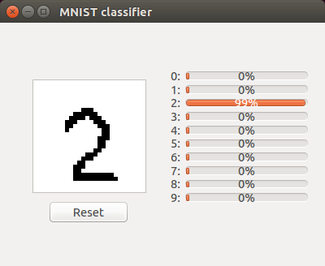

# torch-mnist
MNIST classifier implemented in torch

## requirements
This program has been developed on Ubuntu 14.04.

- torch
- nn
- optim
- xlua
- mnist

### for GPU
- cutorch
- cunn

### for GUI
- `apt-get install qt4-default`
- qttorch
- qtlua

## usage
- `th run.lua`
- if you want use GPU, `th run.lua -type cuda`
- for more detail, `th -h run.lua`

## GUI
- `qlua mnist_gui.lua`

## Licence
- MIT
